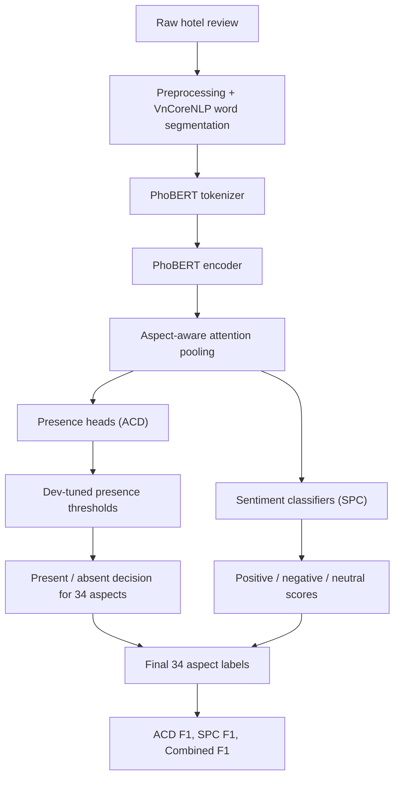

# PhoBERT Best Single Model - Version 3

Đây là bản PhoBERT single model dùng làm kết quả chính sau khi cập nhật pipeline
version 3. Không dùng ensemble. Kết quả tốt nhất hiện tại là `cls_only` với
Combined F1 `0.6218`.

## Kết quả chính

| Model | Dev ACD F1 | Dev SPC F1 | Dev Combined | Test ACD F1 | Test SPC F1 | Test Combined |
|---|---:|---:|---:|---:|---:|---:|
| PhoBERT v1 best `cls_only` | 0.6271 | 0.4630 | 0.5451 | 0.6360 | 0.4727 | 0.5543 |
| Version 3 `concat_4_layers` | 0.6940 | 0.5311 | 0.6126 | 0.6827 | 0.5374 | 0.6101 |
| **Version 3 `cls_only`** | **0.6860** | **0.5307** | **0.6083** | **0.6849** | **0.5587** | **0.6218** |
| SOTA tham chiếu | 0.8255 | - | 0.7732 | 0.8255 | - | 0.7732 |

Kết quả chính chọn `cls_only` vì Test Combined F1 `0.6218` cao hơn
`concat_4_layers` (`0.6101`). So với baseline PhoBERT cũ `0.5543`, version 3
tăng `+0.0675` Combined F1.

## Config version 3

| Tham số | Giá trị | Ý nghĩa |
|---|---:|---|
| Backbone | `vinai/phobert-base-v2` | Encoder tiếng Việt đã pretrained, phù hợp với text word-segmented. |
| Encoder chính | `cls_only` | Dùng vector 768 chiều, ít tham số hơn concat nên tổng quát tốt hơn trong kết quả hiện tại. |
| Encoder ablation | `concat_4_layers` | Ghép 4 hidden layers cuối, mạnh hơn về biểu diễn nhưng nhiều tham số hơn. |
| `max_seq_len` | 256 | Giới hạn chiều dài review sau tokenization, đủ cho phần lớn dữ liệu và an toàn trên T4. |
| `batch_size` | 8 | Batch vật lý trên GPU. |
| `grad_accumulation_steps` | 2 | Tích lũy gradient để batch hiệu dụng là 16. |
| `learning_rate` | `1e-4` | LR chính; thí nghiệm `2e-5` cho kết quả thấp hơn rõ rệt. |
| `warmup_ratio` | 0.15 | Warmup 15% tổng training steps để ổn định fine-tuning. |
| `max_epochs` | 20 | Trần số epoch; checkpoint tốt nhất chọn theo dev Combined F1. |
| `early_stop_patience` | 7 | Cho phép F1 dao động trước khi dừng. |
| Optimizer | `AdamW` | Có weight decay, phù hợp fine-tuning transformer hơn Adam thường. |
| `weight_decay` | 0.01 | Regularization cho trọng số. |
| `head_lr_mult` | 5.0 | Classification heads mới học nhanh hơn encoder pretrained. |
| `layerwise_lr_decay` | 0.92 | Layer thấp của PhoBERT cập nhật nhẹ hơn layer cao. |
| `dropout` | 0.2 | Giảm overfitting. |
| `focal_gamma` | 2.0 | Nhấn mạnh các mẫu khó trong loss. |
| `weight_clip` | 10.0 | Chặn class weights quá lớn, nhất là neutral rất hiếm. |
| `use_split_loss` | `True` | Tách ACD và SPC thành 2 bài toán con. |
| `lambda_presence` | 1.0 | Trọng số loss phát hiện aspect. |
| `lambda_sentiment` | 1.0 | Trọng số loss sentiment. |
| `use_attention_pooling` | `True` | Tạo representation riêng cho từng aspect thay vì dùng một vector chung. |
| `attn_dim` | 128 | Kích thước attention query theo aspect. |
| `use_rare_oversampling` | `True` | Lấy mẫu nhiều hơn các review chứa rare aspects. |
| `rare_oversample_alpha` | 2.0 | Mức tăng weight cho sample chứa rare aspect. |
| `rare_aspect_mult` | 2.0 | Nhân class weight cho rare aspects. |
| `rare_presence_pos_mult` | 1.4 | Tăng trọng số positive presence của rare aspects. |
| `rare_sentiment_mult` | 1.25 | Tăng trọng số sentiment loss cho rare aspects. |
| `tune_presence_threshold` | `True` | Tune ngưỡng present/absent trên dev. |
| `presence_threshold_mode` | `per_aspect_combined` | Tối ưu threshold theo từng aspect dựa trên Combined F1. |
| `presence_threshold_grid` | `[0.35, 0.4, 0.45, 0.5, 0.55, 0.6]` | Các ngưỡng thử trên dev. |
| `use_gradient_checkpointing` | `True` | Giảm VRAM để chạy model lớn hơn trên T4. |
| `mc_dropout_passes` | 3 | Trung bình nhiều dropout pass khi training. |
| `max_grad_norm` | 1.0 | Gradient clipping để tránh update quá mạnh. |

## Luồng xử lý tổng quát



## Luồng train và predict

### 1. Data preprocessing

Input là review gốc trong VLSP 2018 Hotel. Text được chuẩn hóa và word-segment
bằng VnCoreNLP, tạo cột `processed_review`.

Mục đích:
- đưa text về format gần với dữ liệu PhoBERT đã pretrained;
- nối từ ghép tiếng Việt như `khách_sạn`, `dịch_vụ`, `nhân_viên`;
- giảm nhiễu tokenization.

### 2. Dataloader và rare oversampling

Dataloader đọc `processed_review` và 34 cột aspect label. Mỗi aspect có nhãn:

| Nhãn | Ý nghĩa |
|---:|---|
| 0 | `absent` |
| 1 | `positive` |
| 2 | `negative` |
| 3 | `neutral` |

Khi training, `WeightedRandomSampler` tăng xác suất lấy các review chứa rare
aspects. Mục đích là cải thiện macro F1 vì macro metric tính đều theo aspect,
không ưu tiên aspect nhiều mẫu.

### 3. PhoBERT encoder

Tokenizer biến review thành `input_ids` và `attention_mask`. PhoBERT sinh hidden
states cho từng token.

Với `cls_only`, mô hình dùng hidden state cuối. Với `concat_4_layers`, mô hình
ghép 4 hidden states cuối. Kết quả hiện tại cho thấy `cls_only` có Test Combined
F1 tốt hơn nên được chọn làm bản chính.

### 4. Aspect-aware attention pooling

Thay vì dùng một vector chung cho toàn review, version 3 học representation riêng
cho từng aspect. Mỗi aspect có một query vector để chú ý vào token liên quan.

Ví dụ:
- `ROOMS#CLEANLINESS` chú ý vào các từ như `phòng`, `sạch`;
- `SERVICE#GENERAL` chú ý vào `nhân_viên`, `phục_vụ`, `chậm`;
- `FOOD&DRINKS#QUALITY` chú ý vào `món_ăn`, `bữa_sáng`, `ngon`.

Mục đích: cùng một review có thể chứa nhiều aspect khác nhau, nên mỗi aspect
cần nhìn vào phần câu khác nhau.

### 5. Split ACD/SPC loss

Notebook cũ dự đoán trực tiếp 4 lớp `absent/positive/negative/neutral`. Version
3 tách thành hai nhánh:

1. **Presence head** dự đoán aspect có xuất hiện hay không.
2. **Sentiment classifier** dự đoán `positive/negative/neutral` cho aspect đã xuất hiện.

Loss tổng:

```text
loss = lambda_presence * presence_loss + lambda_sentiment * sentiment_loss
```

Mục đích:
- ACD và SPC đúng là hai bài toán khác nhau;
- tránh để lớp `absent` áp đảo toàn bộ 4-class classifier;
- cải thiện cả ACD F1 lẫn SPC F1.

### 6. Threshold tuning

Sau khi chọn checkpoint tốt nhất, mô hình tune threshold present/absent trên dev.
Không dùng mặc định `0.5` cho mọi aspect. Version 3 thử các ngưỡng:

```text
0.35, 0.40, 0.45, 0.50, 0.55, 0.60
```

Kết quả tuning:

| Model | Dev Combined trước tuning | Dev Combined sau tuning |
|---|---:|---:|
| `concat_4_layers` | 0.6035 | 0.6126 |
| `cls_only` | 0.5996 | 0.6083 |

Mục đích: tối ưu trực tiếp Combined F1 trên dev, đặc biệt hữu ích với aspect
hiếm và class imbalance.

### 7. Evaluation

Mô hình tạo 34 nhãn cuối cùng cho mỗi review. Metric chính:

```text
Combined F1 = (ACD F1 + SPC F1) / 2
```

`ROOM_AMENITIES#PRICES` được ghi nhận là aspect có 0 training samples, nên F1
thấp là hợp lý và cần giải thích trong báo cáo.

## Cách chạy

Notebook kết quả hiện tại:

```text
notebooks/phobert_vnccorenlp_version3_done.ipynb
```

Output kết quả:

```text
outputs/results/phobert_results_version3
```

Nếu chạy lại trên Kaggle:

1. Bật GPU T4.
2. Bật Internet.
3. Clone/pull branch `feature/change-phobert`.
4. Chạy notebook theo thứ tự cell.
5. Dùng `cls_only` làm kết quả chính nếu tiếp tục cao hơn `concat_4_layers`.

Các lệnh Python chính trong notebook:

```python
from run_experiment import main

test_metrics_concat = main(encoder_option="concat_4_layers", use_amp=True)
test_metrics_cls = main(encoder_option="cls_only", use_amp=True)
```

## Phân tích kết quả

Version 3 tăng mạnh so với notebook cũ vì áp dụng đồng thời:

1. **Aspect-aware attention pooling**: mỗi aspect có representation riêng.
2. **Split ACD/SPC loss**: tách phát hiện aspect và phân loại sentiment.
3. **Threshold tuning**: tối ưu ngưỡng present/absent theo dev Combined F1.
4. **Rare aspect oversampling**: giúp các aspect hiếm được học nhiều hơn.
5. **AdamW + head LR multiplier + layer-wise LR decay**: fine-tune encoder ổn định
   hơn và cho heads mới học nhanh hơn.

Điểm yếu còn lại:

- 4 aspect có ACD F1 bằng 0 trên test:
  - `FACILITIES#MISCELLANEOUS`
  - `ROOMS#MISCELLANEOUS`
  - `ROOM_AMENITIES#MISCELLANEOUS`
  - `ROOM_AMENITIES#PRICES`
- Các aspect này rất hiếm; riêng `ROOM_AMENITIES#PRICES` có 0 sample train.
- SPC vẫn khó hơn ACD vì sentiment có thể mơ hồ, nhiều aspect cùng xuất hiện
  trong một review, và class `neutral` rất ít.

## Ví dụ chi tiết một review đi qua pipeline

Review gốc:

```text
Phòng sạch, giường rất thoải mái nhưng nhân viên phục vụ chậm.
```

### Chặng 1: Preprocessing + VnCoreNLP

Output minh họa:

```text
Phòng sạch , giường rất thoải_mái nhưng nhân_viên phục_vụ chậm .
```

Mục đích:
- chuẩn hóa câu;
- nối từ ghép như `thoải_mái`, `nhân_viên`, `phục_vụ`;
- giúp input phù hợp hơn với PhoBERT.

### Chặng 2: PhoBERT tokenizer

Output dạng khái niệm:

```text
tokens = ["Phòng", "sạch", ",", "giường", "rất", "thoải_mái",
          "nhưng", "nhân_viên", "phục_vụ", "chậm", "."]
input_ids = [token_id_1, token_id_2, ..., token_id_n]
attention_mask = [1, 1, ..., 1]
```

Mục đích: biến text thành tensor để đưa vào PhoBERT.

### Chặng 3: PhoBERT encoder

Output:

```text
hidden_states: tensor [sequence_length, hidden_size]
```

Mỗi token có một vector ngữ cảnh. Ví dụ `sạch` được hiểu trong ngữ cảnh nói về
`Phòng`, còn `chậm` được hiểu trong ngữ cảnh `nhân_viên phục_vụ`.

### Chặng 4: Aspect-aware attention pooling

Output minh họa:

```text
ROOMS#CLEANLINESS  -> chú ý mạnh vào "Phòng", "sạch"
ROOMS#COMFORT      -> chú ý mạnh vào "giường", "thoải_mái"
SERVICE#GENERAL    -> chú ý mạnh vào "nhân_viên", "phục_vụ", "chậm"
LOCATION#GENERAL   -> không có token liên quan mạnh
```

Mỗi aspect nhận một vector riêng.

### Chặng 5: Presence heads (ACD)

Output minh họa:

| Aspect | presence probability | Threshold | Quyết định |
|---|---:|---:|---|
| `ROOMS#CLEANLINESS` | 0.91 | 0.45 | present |
| `ROOMS#COMFORT` | 0.88 | 0.50 | present |
| `SERVICE#GENERAL` | 0.86 | 0.40 | present |
| `LOCATION#GENERAL` | 0.05 | 0.50 | absent |
| `FOOD&DRINKS#QUALITY` | 0.03 | 0.50 | absent |

Mục đích: xác định aspect nào được review nhắc tới.

### Chặng 6: Sentiment classifiers (SPC)

Chỉ các aspect `present` mới cần sentiment.

| Aspect | positive | negative | neutral | Kết quả |
|---|---:|---:|---:|---|
| `ROOMS#CLEANLINESS` | 0.93 | 0.04 | 0.03 | positive |
| `ROOMS#COMFORT` | 0.89 | 0.07 | 0.04 | positive |
| `SERVICE#GENERAL` | 0.08 | 0.87 | 0.05 | negative |

Mục đích: gán polarity cho aspect đã xuất hiện.

### Chặng 7: Output cuối cùng

Output rút gọn:

| Aspect | Label |
|---|---|
| `ROOMS#CLEANLINESS` | positive |
| `ROOMS#COMFORT` | positive |
| `SERVICE#GENERAL` | negative |
| `LOCATION#GENERAL` | absent |
| `FOOD&DRINKS#QUALITY` | absent |

Dạng số theo label mapping:

```text
absent = 0
positive = 1
negative = 2
neutral = 3
```

Ví dụ:

```text
ROOMS#CLEANLINESS -> 1
ROOMS#COMFORT     -> 1
SERVICE#GENERAL   -> 2
LOCATION#GENERAL  -> 0
FOOD&DRINKS#QUALITY -> 0
...
```

Đây là vector 34 nhãn để tính ACD F1, SPC F1 và Combined F1.
